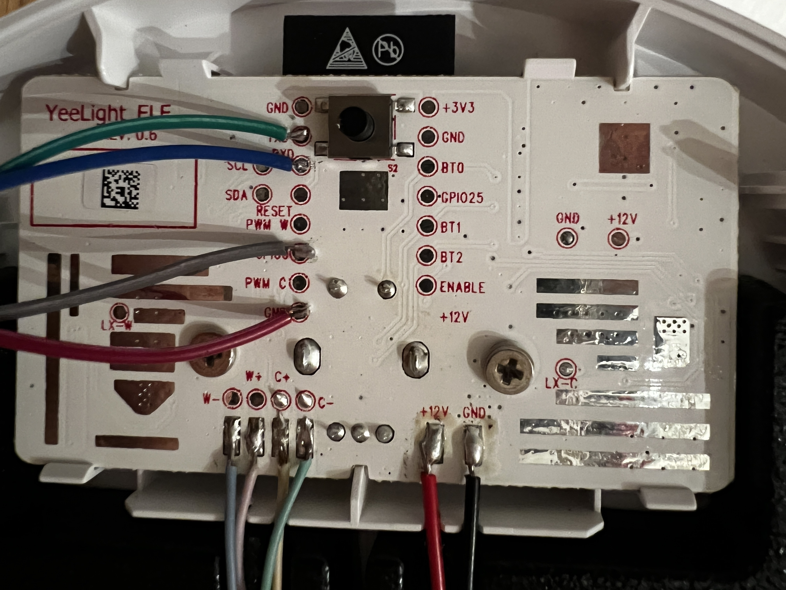

# ESPHome on Xiaomi Smart LED Desk Lamp Pro

This repository describes how to flash ESPHome firmware to Xiaomi Smart LED Desk Lamp Pro in order to use it without
requiring a cloud connection to some chinese servers.

The code is inspired by [this work](https://www.esphome-devices.com/devices/Mi-Desklamp-Pro)
but with some adjustments:
- fixed code was not building on my ARM based macbook
- added nice fade-in/fade-out transition when turning on/off the lamp
- tuned the color calibration
- lamp was defaulting to be turned on, when plugged in (now stores state, but defaults to OFF)  

Also I was missing some documentation on how to prepare the hardware, so I decided to document it here.

## Hardware preparation

In order to flash the custom firmware, you first need to open up the bottom of the lamp by unscrewing 4 small screws
underneath the black rubber.
After opening the lamp, you need to solder 4 wires to the board in order to connect the USB-to-Serial adapter.



After soldering the wires, connect the USB Serial Adapter as follows:

| Lamp Pin | Wire  | Serial Adapter |
|----------|-------|----------------|
| TX       | Green | RX             |
| RX       | Blue  | TX             |
| GPIO0    | Grey  | GND            |
| GND      | Red   | GND            |

In order to force the ESP32 into serial mode, make sure to pull GPIO0 to GND _before_ booting the lamp (aka plugging it
in).

## Software preparation

### Configure secrets

In order to be able to flash, you need to create a secrets.yaml file inside the folder and add the following content to
it:

```yaml
wifi_ssid: "<your ssid>"
wifi_password: "<your wifi password>"
```

### Flash to device

```bash
esphome run lamp.yaml
```

And follow the console application to flash using USB-to-Serial connection or using wireless OTA.